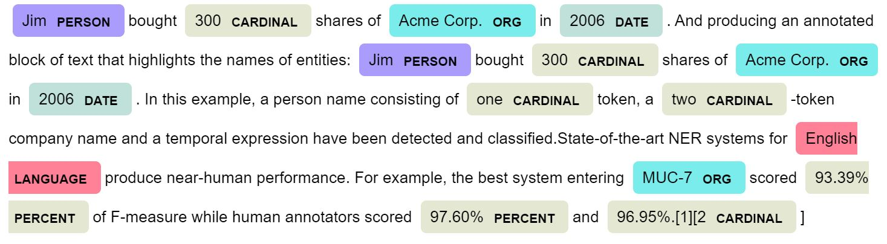

# Named Entity Recognition(NER) with Bi-LSTM
Named-entity recognition (NER) is a subtask of information extraction to identify pre-defined named entities such as organizations, persons, locations, etc from unstructured texts. It is also known as entity identification, entity chunking and entity extraction in some references.

The real world applications of NER are aimed at understanding what a text is about. Some examples of such application would be categorizing tickets in customer support, analyze resumes and customer feedback or even extracting information from emails and initiate accounting processes accordingly.

In this project, Bidirectional LSTM algorithm is utilized to learn and recognize entities in sentences based on previous seen examples.

##Data
There are many ner_dataset.csv data sets on Kaggl. We will be using a subset of the ner_dataset.csv DataSet obtained from Kaggle that can be downloaded from
[this link](https://www.kaggle.com/abhinavwalia95/entity-annotated-corpus?select=ner_dataset.csv).

The data consist of Sentence, Word, POS and Tag as you can see below.

Following is a visual representation of tagged entities highlighted in a body of text using spaCy:




# Quick start
**unzip the "ner_dataset.csv.zip" file located in folder "dataset". Make sure the file "ner_dataset.csv" is accessible by Jupiter notebook as "dataset\ner_dataset.csv"**



## Dependencies
* Pandas
* Numpy


How to use?
===========
The project is developed in Jupyter Notebooks which is automatically rendered by GitHub. The developed codes and functions for each step are explained in the notebook.









